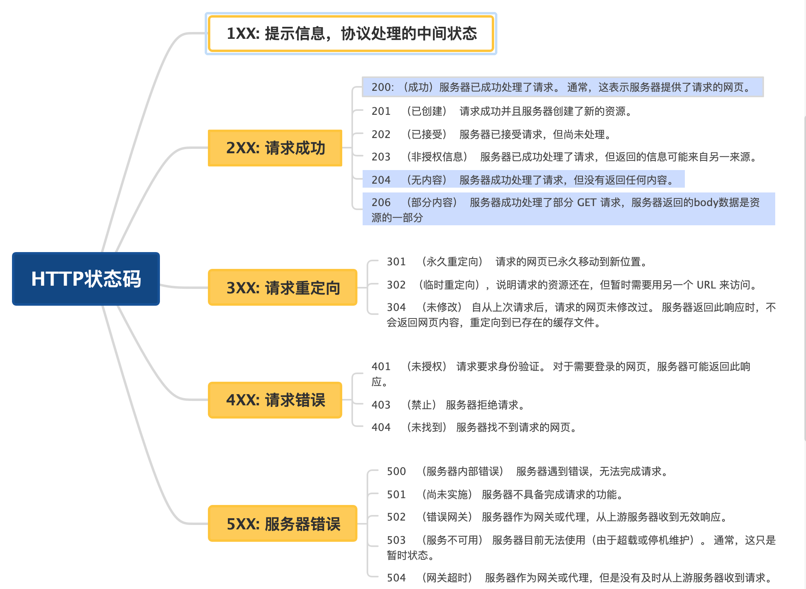

# Common HTTP Status Code

When client sends HTTP request, server will respond with an HTTP status code in the response header.

* 1xx - information
* 2xx - success
* 3xx - redirect
* 4xx - client errors
* 5xx - server errors

### 1xx - Information
#### 100 Continue
Indicates that the initial part of a request has been received and the client may continue with the request body.

#### 101 Switch Protocol
Server sent in response to upgrade the protocol specified in request header.

#### **Protocol hierarchy (from low to high level)** (from ChatGPT)

| Layer                      | Type                          | Example Protocols                      | What it does                                      |
|---------------------------|-------------------------------|----------------------------------------|---------------------------------------------------|
| 🧱 1. Transport Layer      | 🔧 Basic transport             | TCP, UDP                               | Raw data delivery                                |
| 🔒 2. Security Layer       | 🔐 Encryption                  | TLS/SSL                                | Secures data                                      |
| 🌍 3. Base Protocols       | 🌐 Request/response            | HTTP/1.1, HTTP/2, HTTP/3                | How the web works                                 |
| 🔁 4. Upgraded Protocols   | ↔️ Bi-directional / advanced   | WebSocket, gRPC, h2c, custom protocols | Real-time, streaming, or optimized communication |
| 🧠 5. Application Layer    | 👥 Business logic              | GraphQL, REST, file transfer           | What your app actually “does”                     |

### 2xx - Success
#### 200 OK
Successfully requested.

#### 201 Created
Successfully requested and created resource (Usually for PUT/POST).

#### 202 Accepted
Server accepted the request but not yet completed processing.

> 100 Continue vs 202 Accepted
> 
> - 100 Occurs **before** the full request is sent. 
> - 202 Occurs **after** the complete request is received. 

#### 203 Non-Authoritative Information
Request succeeded. However, the metadata is not returned from the original server, 
but returned from local or third-party as a copy.

#### 204 No Content
Request processed successfully and nothing returned. 

#### 205 Reset Document
Request processed successfully. Client should reset the document view.

> 204 vs 205 Example
> 
> After submitting a form, return code 204 will not change anything (user input preserved),
> but 205 will erase the user input.

#### 206 Partial Content
When client sent a range request, 206 is returned in response to request of a part of parts of a resource.

> Range Request 范围请求
> 
> Usually for large file download, video streaming, etc. 

### 3xx - Redirect

#### 300 Multiple Choices
In an Agent-Driven Negotiation setting, if the request has multiple responses, the user agent can choose one of them.

> Agent-Driven Negotiation: 
> - Server sends a list of available options, **client/user agent** selects.
> - High flexibility and privacy.
> - Examples: Image format selection, manual language selection..

> Server-Driven Negotiation
> - The **server** decides based on request headers.
> - Low bandwidth. 
> - Examples: encoding formats, document types..

#### 301 Moved Permanently
URI requested is moved permanently. New URI is given in the response body. All future 
request will be directed to new URI.

#### 302 Found
URI requested is moved temporarily. 

#### 303 See Other
Direct client to get resource at another URI using GET method.

#### 307 Temporary Redirect
Similar to 302, but must not change HTTP method.

#### 308 Permanent Redirect
Similar to 301, but must not change HTTP method.

> URI, URL, URN
> 
> URI contains URL and URN. 
> - URI: Uniform Resource Identifier.
> - URL: Uniform Resource Locator.
> - URN: Uniform Resource Name.

### 4xx - Client Errors

#### 400 Bad Request
Server cannot and will not process the request, such as malformed request syntax.

#### 401 Unauthorized
In fact, this refers to "unauthenticated". Client must authenticate to get resource.

#### 402 Payment Expired
Used for online payment system.

#### 403 Forbidden
Client identity is known to the server (request has valid credentials), but doesn't have access right to the resource.

#### 404 Not Found
Cannot find resource. URL not recognizable.

#### 405 Method Not Allowed
Server recognize the request method, but does not support it, such as DELETE or TRACE.

#### 406 Not Acceptable
In a server-driven negotiation setting, the server cannot find content that conforms to the criteria
requested by the agent.

For example, the agent asks for XML files, but the resource only contains txt files.

#### 407 Proxy Authentication Required
Similar to `401 Unauthorized`, but requires a proxy to be authenticated.

#### 408 Request Time Out
Server waited request for too long. Server would like to shut down the connection.

### 5xx Server Errors

#### 500 Internal Server Error
Server encountered unexpected situation and is unable to fulfill the request.

#### 501 Not Implemented
Server cannot recognize the method.

> All servers are required to support `GET` and `HEAD` methods.

> `405 Method Not Allowed` vs  `501 Not Implemented`
> 
> - (405) server knows the method
> - (501) server does not know the method

#### 502 Bad Gateway
Gateway received an invalid response from server.

#### 503 Server Unavailable
Server is not ready to process request, such as down for maintenance or overloaded.

> Overload: Server received too many requests that exceeds its capacity to process

#### 504 Gateway Timeout
Gateway did not receive response for too long.

> proxy/gateway: a middleman that forwards your request
> - Forward Proxy: a proxy that helps client access the outside world (VPN, Company LAN)
> - Reverse Proxy: a proxy that helps server receives/filters requests

## References
- [HTTP response status codes](https://developer.mozilla.org/en-US/docs/Web/HTTP/Reference/Status#successful_responses)