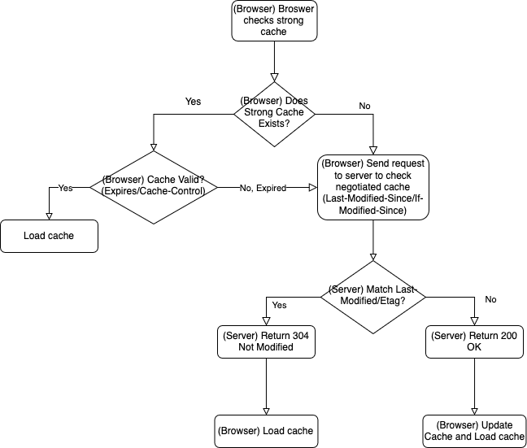
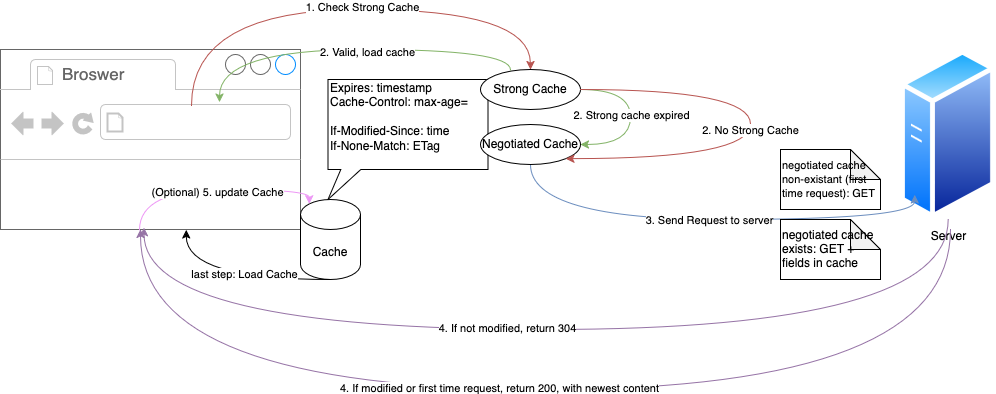

# What is strong cache? What is negotiated/conditional cache?

They are both HTTP caching mechanisms that help improve web performance.
They help reduce server load, speed up webpage loading, and save bandwidth. 

### Strong Cache 
In browsers, strong caching is controlled by two headers: `Expires` (HTTP/1.0) and `Cache-Control` (HTTP/1.1).

> If both `Expires` and `Cache-Control` are present, `Cache-Control` takes precedence.

Expires specifis expriation time of a resource.
The time is an absolute timestamp return by the server. 
The browser uses local system time to compare with the field.

However, the discrepenceies between the client and server clocks can lead to cache inconsistencies.

### Negotiated Cache
There are two sets of paired headers. 

When browser makes its first request, the server include either `Last-Modified` or `ETag` header in the response.
Subsequent requests will contain `If-Modified-Since` or `If-None-Match` field to determine whether the resource is changed or not.

If the browser's requested `If-Modified-Since` matches server's `Last-Modified`, or if browser's `If-None-Match` matches server's `ETag`,
the server will return status code 304 Not Modified, and browser will load cache; Otherwise, the server responds with 200 OK 
and the updated resource in the response body. The browser then stores the content in the cache (both strong and negotiated, if applicable), 
and renders the content.

- `Last-Modified`/`If-Modified-Since`

The request incude `If-Modified-Since` that is the same value as `Last-Modified` return from the server.
The server checks the value upon receive.

> Issue1 with time modified: Because the cache only relies on modification time, the field might change even if the file content remains the same.
> For example, change the filename then change back.

> Issue2 with time precision: When a file is modified within a very short period of time (e.g., a few hundred milliseconds), 
> the file's last modified time might not change. This is because the timestamp's precision is typically only up to seconds. 
> As a result, even if the file content has changed, the modification time may remain the same, and the server might not return the updated file.

- `ETag`/`If-None-Match`

ETag is a unique identifier of a resource. When the resource change, the ETag also changes.
ETag ensures more accurate cache validation since it acts as a fingerprint for the resource content. 

`If-None-Match` is sent by the browser in a request, containing the ETag value.

> How do we find server's `Etag` and `Last-Modified` ? 
> 
> They are usually generated by the server based on the resource's current state. 
> `Last-Modified` is usually stored in the file's metadata. 
> `Etag` is usually generated dynamically by the server through certain algorithms such as Hash.

## Chinese Version: 什么是强缓存和协商缓存

强缓存和协商缓存是HTTP缓存机制的两种类型，它们用于减少服务器的负担和提高网页加载速度。

1. 强缓存：客户端在没有向服务器发送请求的情况下，直接从本地缓存中获取资源
- Expires强缓存：设置一个强缓存时间，此时间范围内，从内存中读取缓存并返回。
但是因为Expires判断强缓存过期的机制是获取**本地时间戳**，与之前拿到的资源文件中的`Expires`字段的时间做比较来判断是否需要对服务器发起请求。
这里有一个巨大的漏洞：“如果我本地时间不准咋办？”所以目前已经被废弃了。

- Cache-Control强缓存：目前使用的强缓存是通过HTTP响应头中的`Cache-Control`字段实现，通过`max-age`来告诉浏览器在指定时间内可以直接使用缓存数据，无需再次请求。

2. 协商缓存：当强缓存失效时，浏览器会发送请求到服务器，通过ETag或Last-Modified等HTTP响应头与服务器进行验证，以确定资源是否被修改。 

    如果资源未修改，服务器返回304 Not Modified状态码，告知浏览器使用本地缓存；如果资源已修改，则返回新的资源，浏览器更新本地缓存。

    这种方式需要与服务器通信，但可以确保用户总是获取最新的内容。

- 基于Last-Modified的协商缓存：
  - Last-Modified 是资源的最后修改时间，服务器在响应头部中返回。
  - 当客户端读取到Last-modified的时候，会在下次的请求标头中携带一个字段:If-Modified-Since，而这个请求头中的If-Modified-Since就是服务器第一次修改时候给他的时间
  - 服务器比较请求中的 If-Modified-Since 值与当前资源的 Last-Modified 值，如果比对的结果是没有变化，表示资源未发生变化，返回状态码 304 Not Modified。
  如果比对的结果说资源已经更新了，就会给浏览器正常返回资源，返回200状态。

  但是这样的协商缓存有两个缺点：
  - 因为是更改文件修改时间来判断的，所以在文件内容本身不修改的情况下，依然有可能更新文件修改时间（比如修改文件名再改回来），这样，就有可能文件内容明明没有修改，但是缓存依然失效了。
  - 当文件在极短时间内完成修改的时候（比如几百毫秒）。因为文件修改时间记录的最小单位是秒，所以，如果文件在几百毫秒内完成修改的话，文件修改时间不会改变，这样，即使文件内容修改了，依然不会返回新的文件。

- 基于ETag的协商缓存：将原先协商缓存的比较时间戳的形式修改成了比较文件指纹（根据文件内容计算出的唯一哈希值）。
  - ETag 是服务器为资源生成的唯一标识符（文件指纹），可以是根据文件内容计算出的哈希值，服务端将其和资源一起放回给客户端。
  - 客户端在请求头部的 If-None-Match 字段中携带上次响应的 ETag 值。
  - 服务器比较请求中的 If-None-Match 值与当前资源的 ETag 值，如果匹配，表示资源未发生变化，返回状态码 304 Not Modified。如果两个文件指纹不吻合，则说明文件被更改，那么将新的文件指纹重新存储到响应头的ETag中并返回给客户端

## Reference
- [HTTP Caching Explained: Strong Cache vs. Negotiated Cache](https://leapcell.io/blog/http-caching-explained)